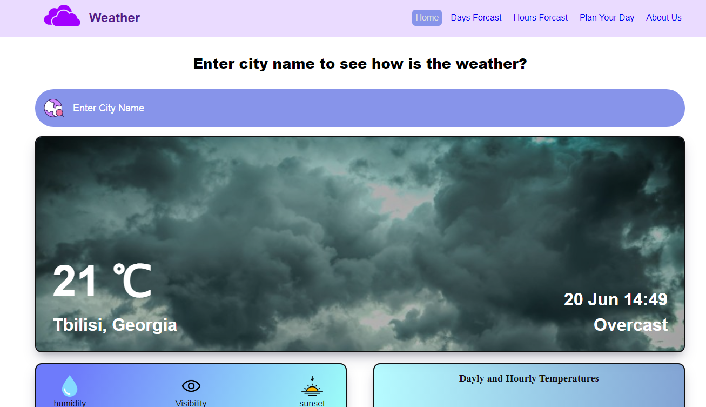
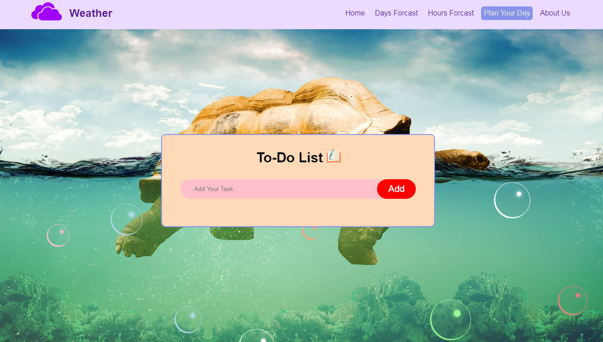

## Weather Web App

This is Weather Web app, where you can see current and forcast weather information. Also it has simple to do list to plan your day and bubble animation. This applicaiton is getting data from Weatherapi, however to get forcast data for different countries you need premium subscription, so it won't work for new york or similar big cities. But for country Georgia you can check weather for different cities. The website is responsive. You can simply download this project and run it on localhost. For windows you can use XAMPP. This website is hosted on replit and you can check it with this [link](https://weatherwebapp--muzacore.repl.co/index.php).

  

  

