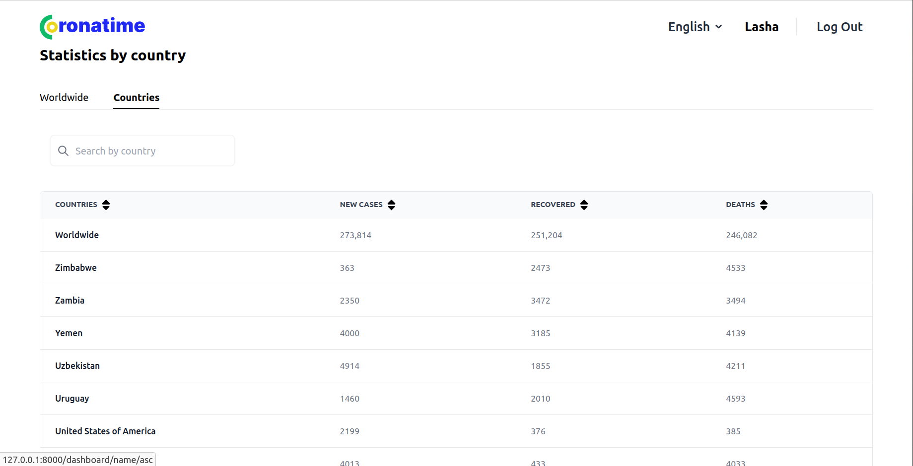

## Table of Contents

 * [Introduction](#introduction)
 * [Prerequisites](#prerequisites)
 * [Tech Stack](#tech-stack)
 * [Getting started](#getting-started)
 * [Development](#development)
 * [Deployment](#deployment)
 * [Resources](#resources)

## Introduction

The Coronatime is a website, where you can register and after verification of your account, you can see the statistics of corona in different countries. On how to get started please check [getting started](#getting-started).
<p align="center">
  
</p>

## Prerequisites

 - PHP@8.1.9 and up
 - MYSQL@8 and up
 - npm@6.14.17 and up
 - composer@2.4 and up

## Tech Stack


 - [Laravel@9.x](https://laravel.com/docs/9.x) - back-end framework
 - [tailwindcss](https://tailwindcss.com/docs/installation) - front-end


## Getting started

1\. First, you need to clone coronatime from github:
```sh
git clone https://github.com/RedberryInternship/lasha-muzashvili-corona-time.git
```
```sh
cd lasha-muzashvili-corona-time/
```

2\. Next step requires you to run *composer install* in order to install all the dependencies.
```sh
composer install
```

3\. after you have installed all the PHP dependencies, it's time to install all the JS dependencies:
```sh
npm install
```

and also:
```sh
npm run dev
```
in order to build your JS/SaaS resources.


4\. Now we need to set our env file. Go to the root of your project and execute this command.
```sh
cp .env.example .env
```
And now you should provide **.env** file all the necessary environment variables.

after setting up **.env** file, execute:
```sh
php artisan config:cache
```
in order to cache environment variables.

```sh
php artisan migrate
```

4\. Now execute in the root of your project following:
```sh
  php artisan key:generate
```

Which generates auth key.

##### Now, you should be good to go!

## Development

You can run Laravel's built-in development server by executing:

```sh
  php artisan serve
```

Then run this command:

```sh
  npm run dev
```

You can fetch data with this command:

```sh
  php artisan fetch:data
```
Now you can log in and see statistics.

## Resources
 - [drawSQL Diagram](https://drawsql.app/teams/redberry-28/diagrams/coronatime)
 - [design](https://www.figma.com/file/O9A950iYrHgZHtBuCtNSY8/Coronatime)
