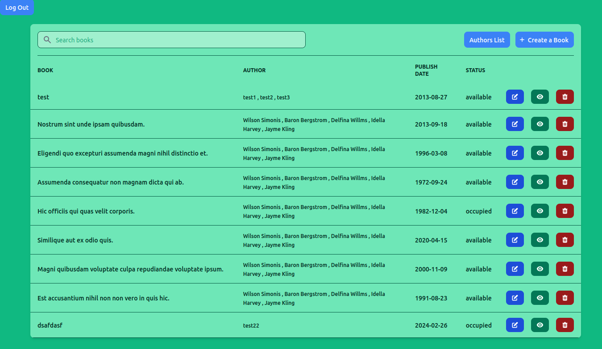
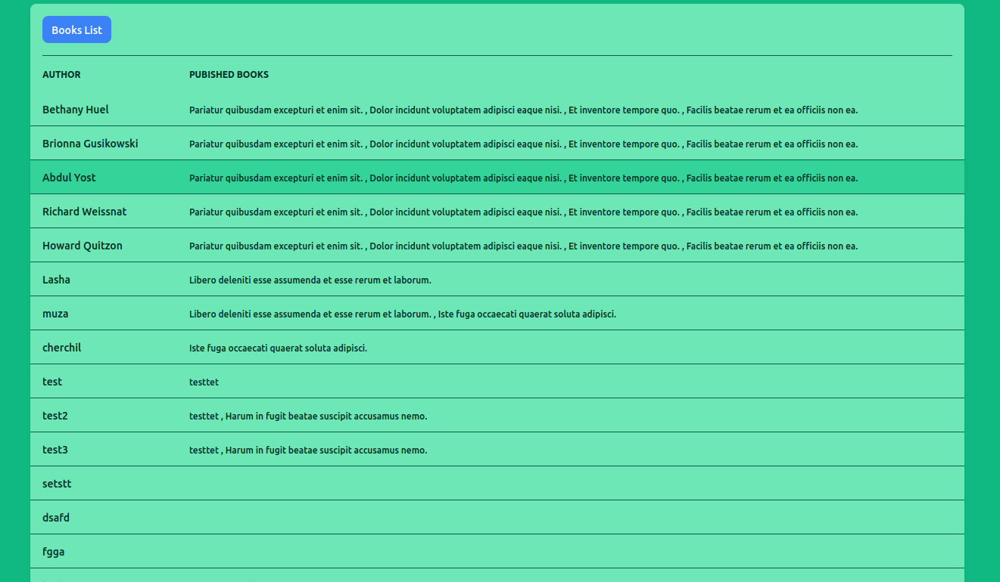

## Table of Contents

 * [Library](#Library)
 * [Introduction](#introduction)
 * [Prerequisites](#prerequisites)
 * [Tech Stack](#tech-stack)
 * [Getting started](#getting-started)
 * [Development](#development)
 * [Resources](#resources)

## Library

- Administrator should be able to view, add, delete, and edit books in the library.
- Also to view Authors list.
- Books can have statuses - available, occupied.
- When adding a book the required fields are:
- Author(Authors), Name, Publish Date, Status (available, occupied).
- One author can have many books and one book can have many authors (Many to many).
- Additional Functionality: search/Filter by author and book name.

### Features to be implemented

- ~~Database models and setup.~~ 
- ~~Admin authentication and dashboard.~~
- ~~Admin book management.~~
- ~~View authors list.~~
- ~~Search by book name or by author.~~
- ~~User interface design.~~

## Introduction

The Library is a website, where admin can do CRUD(create, read, update, delete) operations on books. Admin can register using console command and login on the website, after that he can do CRUD, view authors list and search books by author name and by book name.
To use this website, please check -> [getting started](#getting-started).
<p align="center">
  
</p>
<p align="center">
  
</p>

## Prerequisites

 - PHP@8.1 and up
 - MYSQL@8 and up
 - npm@10.2.4 and up
 - composer@2.7 and up

## Tech Stack

 - [Laravel@10.x](https://laravel.com/) - back-end framework
 - [tailwindcss](https://tailwindcss.com/) - front-end

## Getting started

1\. First, you need to clone library from github, you can specify name for directory in space of my-library:
```sh
git clone git@github.com:Muza21/library.git my-library
```
```sh
cd my-library
```

2\. Next step requires you to run *composer install* in order to install all the dependencies.
```sh
composer install
```

3\. after you have installed all the PHP dependencies, it's time to install all the JS dependencies:
```sh
npm install
```

and also:
```sh
npm run build
```
in order to build your JS/SaaS resources.


4\. Now we need to set our env file. Go to the root of your project and execute this command.
```sh
cp .env.example .env
```
Now execute in the root of your project following:
```sh
  php artisan key:generate
```
And you should provide **.env** file all the necessary environment variables (in this case, database variables).
after setting up **.env** file, execute:
```sh
php artisan config:cache
```
in order to cache environment variables.


5\. next:
```sh
php artisan migrate
```


##### Now, you should be good to go!

## Development

You can run Laravel's built-in development server by executing:

```sh
  php artisan serve
```

Then run this command:

```sh
  npm run dev
```

You can seed database if you want to:

```sh
  php artisan db:seed
```

Or you can create admin account with this command:

```sh
  php artisan register:admin
```
After registering, log in and check out the website.

That's it, thank you for your time.

## Resources
 - [drawSQL Diagram](https://drawsql.app/teams/muza-1/diagrams/library)