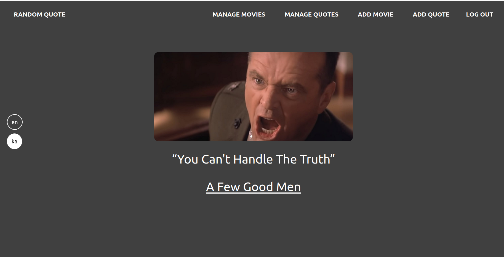

## Table of Contents

 * [Introduction](#introduction)
 * [Prerequisites](#prerequisites)
 * [Tech Stack](#tech-stack)
 * [Getting started](#getting-started)
 * [Development](#development)
 * [Deployment](#deployment)
 * [Resources](#resources)

## Introduction

The Movie-Quote is a website, where for each refresh you get a movie quote in random order.
This website has two sides, one is for guests, and one is for users(admin).
Guests can only see quotes randomly and check all quotes of a movie by clicking the movie title. As for users(admin), they can do CRUD(create, read, update, delete) operations as well.
The quotes can be seen randomly by refreshing the main page.
The users can register only by the terminal. For further information on how to use this website please check [getting started](#getting-started).
<p align="center">
  
</p>
<!--  -->

## Prerequisites

 - PHP@8.1.9 and up
 - MYSQL@8 and up
 - npm@6.14.17 and up
 - composer@2.4 and up

## Tech Stack


 - [Laravel@9.x](https://laravel.com/docs/9.x) - back-end framework
 - [tailwindcss](https://tailwindcss.com/docs/installation) - front-end

## Getting started

1\. First, you need to clone movie-quotes from github:
```sh
git clone https://github.com/RedberryInternship/lasha-muzashvili-movie-quotes.git
```
```sh
cd lasha-muzashvili-movie-quotes/
```

2\. Next step requires you to run *composer install* in order to install all the dependencies.
```sh
composer install
```

3\. after you have installed all the PHP dependencies, it's time to install all the JS dependencies:
```sh
npm install
```

and also:
```sh
npm run dev
```
in order to build your JS/SaaS resources.

Then you need to add storage to public link:
```sh
php artisan storage:link
```


4\. Now we need to set our env file. Go to the root of your project and execute this command.
```sh
cp .env.example .env
```
And now you should provide **.env** file all the necessary environment variables.

after setting up **.env** file, execute:
```sh
php artisan config:cache
```
in order to cache environment variables.

```sh
php artisan migrate
```

4\. Now execute in the root of your project following:
```sh
  php artisan key:generate
```

Which generates auth key.

##### Now, you should be good to go!

## Development

You can run Laravel's built-in development server by executing:

```sh
  php artisan serve
```

Then run this command:

```sh
  npm run dev
```

You can create your user with this command:

```sh
  php artisan create:user
```
Now you can log in and add new movies and quotes.

## Resources
 - [drawSQL Diagram](https://drawsql.app/teams/redberry-28/diagrams/movie-quotes)
 - [design](https://www.figma.com/file/IIJOKK5esgM8uK8pM3D59J/Movie-Quotes?node-id=0%3A1)
